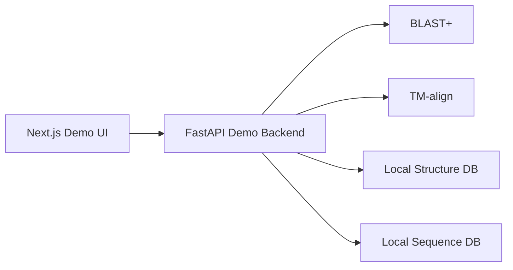
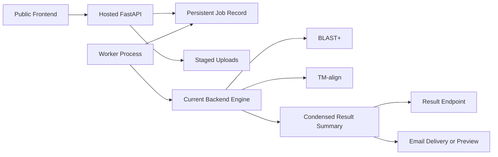

# Structure-based Effector Discovery Pipeline

Research infrastructure for structure-based effector discovery. This project
accepts protein structures, single sequences, and multi-FASTA inputs, then uses
BLAST and TM-align against local effector databases to classify known or novel
effectors.

The repository supports both:

- a synchronous research/demo workflow for direct local use
- a hosted async workflow with persistent jobs, a worker process, staged uploads,
  result summaries, and email-ready completion flow

## Table of contents

1. [Overview](#overview)
2. [Capabilities](#capabilities)
3. [Architecture](#architecture)
4. [Core workflows](#core-workflows)
5. [Repository layout](#repository-layout)
6. [Quick start: local research demo](#quick-start-local-research-demo)
7. [Quick start: hosted async workflow](#quick-start-hosted-async-workflow)
8. [Linux deployment](#linux-deployment)
9. [Status and roadmap](#status-and-roadmap)
10. [Important notes](#important-notes)

## Overview

The project is built around a simple biological question:

- if a submitted protein is already known, identify the matching family quickly
- if it is structurally similar, show the best supported match
- if it is novel or incomplete, return a clear result and preserve a path to
  downstream structure generation workflows

Inputs supported today:

- `.pdb` and `.cif` structure files
- single protein sequences
- multi-FASTA files

Primary local data assets:

- [`Database/`](Database) for curated effector-related structures
- [`effector_sequences.fasta`](effector_sequences.fasta) for sequence search

## Capabilities

### Research engine

- Structure-first comparison against the local PDB database
- Sequence-first discovery through BLASTP against the local FASTA database
- Multi-FASTA batch handling through the same per-sequence logic

### Product-oriented workflow

- Persistent hosted jobs with status tracking
- Per-job access tokens for public job polling and result retrieval
- Upload staging for public-facing workflows
- Background worker process
- Condensed result summaries suitable for UI display and email
- SMTP-ready email integration with preview-file fallback
- SSH/Slurm-backed execution-mode seam for MedicineBow-style HPC submission

## Architecture

### System view

| Layer | Purpose | Primary files |
| --- | --- | --- |
| Frontend demo | Direct synchronous UI for local research workflows | [`frontend/app/page.tsx`](frontend/app/page.tsx) |
| Frontend hosted | Async UI for public-facing job creation and polling | [`frontend/app/hosted/page.tsx`](frontend/app/hosted/page.tsx) |
| Backend demo engine | Core biology pipeline and compatibility endpoints | [`backend/main.py`](backend/main.py) |
| Hosted API | Persistent jobs, uploads, result access | [`backend/hosted_api/main.py`](backend/hosted_api/main.py) |
| Worker | Polls queued hosted jobs and executes them | [`backend/hosted_api/worker.py`](backend/hosted_api/worker.py) |
| Deployment assets | Linux backend deployment templates | [`deploy/linux/`](deploy/linux) |

### Local research/demo architecture



### Hosted async architecture



### Execution modes

- `local`
  - hosted jobs run through the current backend engine on the same server
- `hpc`
  - stages request payloads over SSH and submits a remote Slurm wrapper

The hosted scaffold supports local execution today and includes a configurable
remote submission path for HPC environments that mirror the documented
MedicineBow layout.

## Core workflows

### 1. Structure upload

Primary endpoint:

- `POST /api/process/structure`

Flow:

1. Accept `.pdb` or `.cif`
2. Save upload temporarily
3. Check whether the filename already exists in the local structure database
4. If needed, run TM-align against the local structure database
5. Return best match, TM-score, RMSD, and optional top matches

### 2. Single sequence

Primary endpoint:

- `POST /api/process/sequence`

Flow:

1. Normalize the input sequence
2. Run BLASTP against [`effector_sequences.fasta`](effector_sequences.fasta)
3. Map the best hit to a local structure when possible
4. Run TM-align when structure comparison is available
5. Return classification, match details, and any deferred structure-generation
   placeholder status

### 3. Multi-FASTA

Primary endpoint:

- `POST /api/process/fasta`

Flow:

1. Parse the FASTA file into sequences
2. Run the single-sequence logic per entry
3. Return a per-sequence result list

### 4. Hosted async jobs

Primary endpoints:

- `POST /jobs`
- `POST /jobs/upload`
- `GET /jobs`
- `GET /jobs/{job_id}`
- `GET /jobs/results/{job_id}`
- `GET /jobs/mode`
- `GET /health`

Flow:

1. Create a job
2. Persist metadata and staged input
3. Worker reserves queued jobs
4. Worker executes the current backend engine through the hosted adapter
5. Summary and raw results are stored
6. Email is sent through SMTP or written as a preview file

## Repository layout

```text
backend/
  main.py                    # current synchronous biology engine
  requirements.txt           # local demo/backend dependencies
  requirements-hosted.txt    # hosted backend dependencies
  config/
  hosted_api/
    main.py                 # hosted API entrypoint
    worker.py               # DB-polling worker
    config.py               # hosted runtime config
    db.py                   # SQLAlchemy setup
    models.py               # job persistence
    schemas.py              # API schemas
    routes/jobs.py          # hosted routes
    services/               # adapter, execution, email, job runner
frontend/
  app/
    page.tsx                # original synchronous demo UI
    hosted/page.tsx         # hosted async UI
Database/                    # local structure database
effector_sequences.fasta     # local sequence database
docs/
  DISPATCHER_PRODUCT_PLAN.md
deploy/
  linux/                     # Linux backend deployment assets
```

## Quick start: local research demo

### Requirements

- Python 3.10+
- Node.js 18+

### Install

```powershell
cd backend
py -3 -m pip install -r requirements.txt

cd ..\frontend
npm install
```

### Run

From the repository root:

```powershell
.\start_app.ps1
```

Then open:

- frontend: `http://localhost:3000`
- backend docs: `http://localhost:8000/docs`

This mode is best when you want to validate the biology pipeline locally and
inspect structure and sequence behavior directly.

## Quick start: hosted async workflow

### Install backend dependencies

```powershell
cd backend
py -3 -m pip install -r requirements-hosted.txt
```

### Run the hosted API

```powershell
cd backend
py -3 -m uvicorn hosted_api.main:app --reload
```

### Run the worker

Open a second terminal:

```powershell
cd backend
py -3 -m hosted_api.worker
```

### Run the frontend

```powershell
cd frontend
npm install
npm run dev
```

Open:

- demo UI: `http://localhost:3000`
- hosted async UI: `http://localhost:3000/hosted`

This is the correct path for a future public-facing deployment.

## Linux deployment

Linux backend deployment assets are included under [`deploy/linux/`](deploy/linux).

Key files:

- [`deploy/linux/README.md`](deploy/linux/README.md)
- [`deploy/linux/install_backend.sh`](deploy/linux/install_backend.sh)
- [`deploy/linux/env.backend.example`](deploy/linux/env.backend.example)
- [`deploy/linux/systemd/effectors-api.service`](deploy/linux/systemd/effectors-api.service)
- [`deploy/linux/systemd/effectors-worker.service`](deploy/linux/systemd/effectors-worker.service)
- [`deploy/linux/nginx/effectors-api.conf`](deploy/linux/nginx/effectors-api.conf)

Recommended backend deployment shape:

- Ubuntu VM
- FastAPI hosted backend
- separate worker process
- nginx reverse proxy
- HTTPS via certbot

The deployment templates currently assume:

- repo root at `/opt/effectors/Effectors`
- backend running in `local` execution mode

## Status and roadmap

### Implemented

- Real BLAST integration
- Real TM-align integration
- Structure, sequence, and FASTA workflows in the original frontend
- Hosted async API scaffold with persistent jobs
- Local worker process for queued jobs
- Staged uploads and result retrieval
- SMTP-ready email layer with preview fallback
- Linux backend deployment templates
- Hosted runtime health endpoint
- Upload-size and sequence-length guardrails
- Retry-aware worker execution
- Job-token gated public status/result access
- Admin-key protection for admin-only hosted endpoints
- In-memory rate limiting for public job creation
- Worker lease/heartbeat recovery for stale jobs

### Next major steps

- Extract reusable pipeline services from [`backend/main.py`](backend/main.py)
- Add a stronger queueing system if throughput grows beyond the polling worker
- Replace SQLite/local disk with managed Postgres plus object storage for multi-node deployment

## Important notes

- This repository is research infrastructure, not a finished clinical or
  regulated product.
- The current hosted path is suitable for controlled public deployment after
  environment setup, but heavy compute should eventually move to HPC submission.
- The synchronous demo remains the best place to debug biological logic before
  routing jobs through hosted infrastructure.
